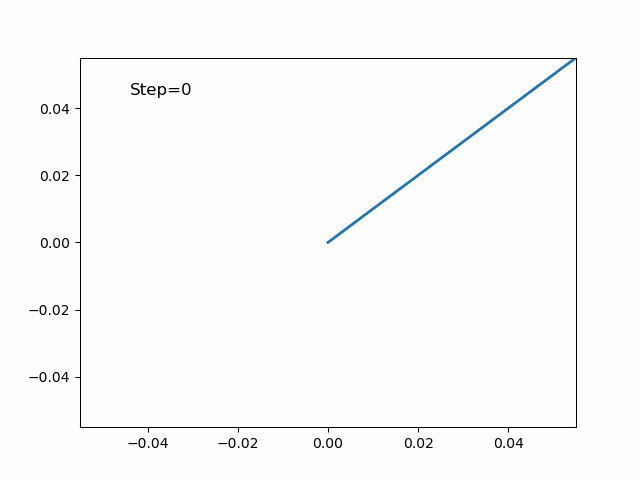
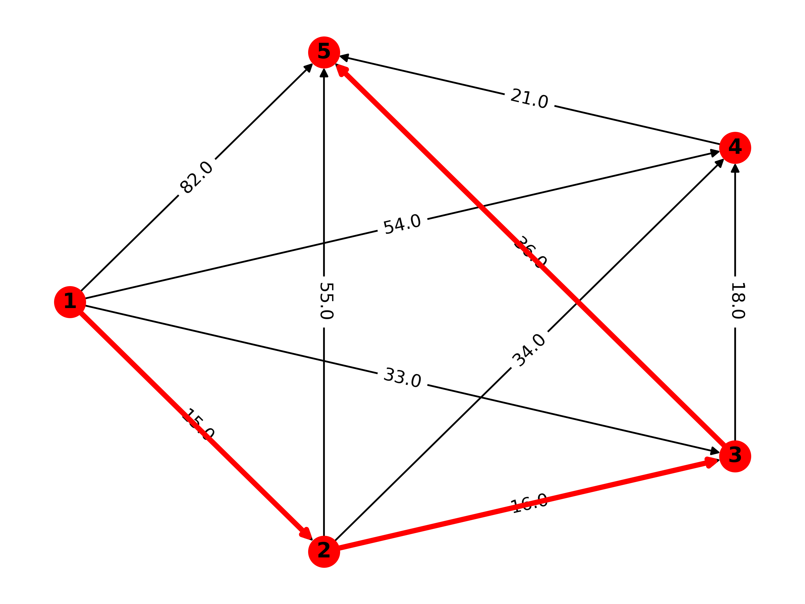
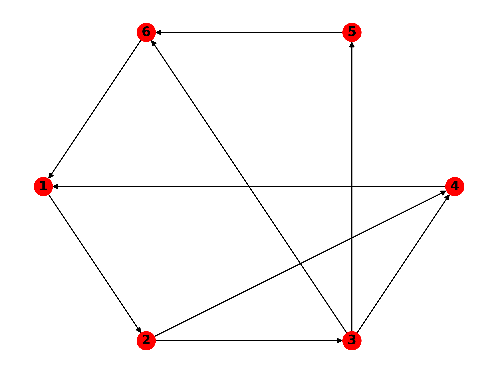
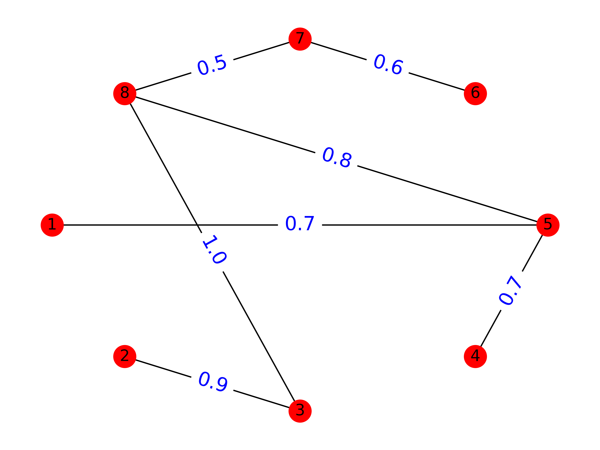
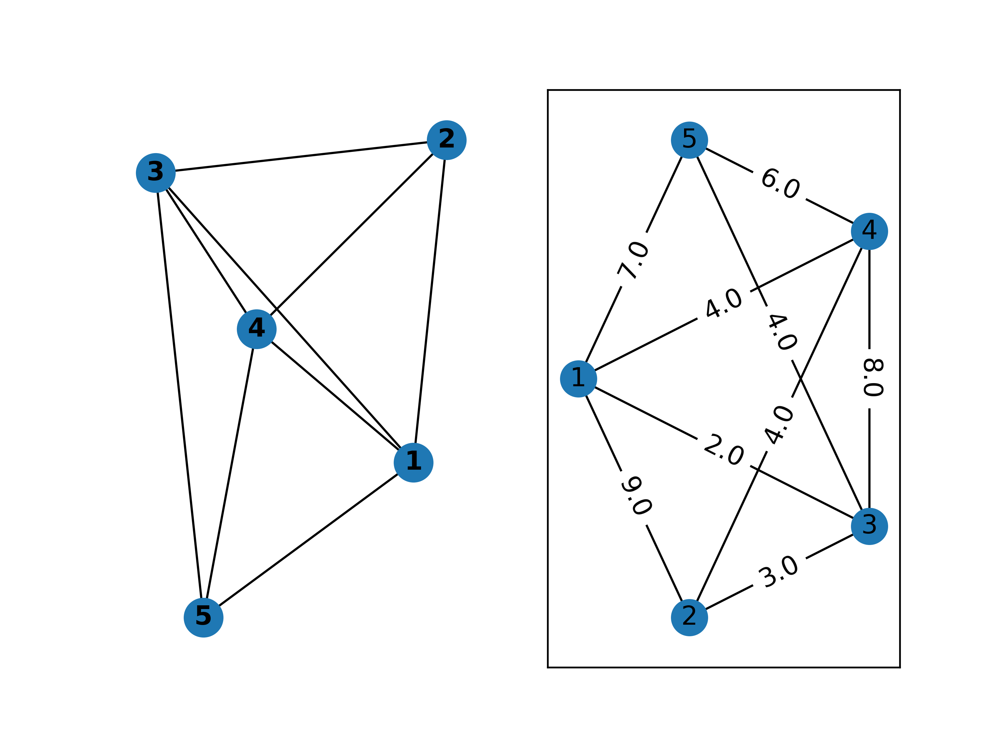

# Python 数学实验与建模

从数值计算到优化建模，从微分方程到机器学习——一个关于数学建模与科学计算的学习实验仓库。

## 写在前面

这个仓库记录了我在学习《Python数学实验与建模》(2021) 过程中的所有代码实验、推导笔记和建模实践。

最开始只是想把 numpy 和 matplotlib 用熟，后来慢慢接触到优化、统计建模、微分方程、图论和机器学习，才发现数学建模本质上是把现实问题转化为可计算问题的过程。从单纯形法到模拟退火，从欧拉方法到Lorenz混沌系统，从Dijkstra到PageRank——每一个notebook都是一次从"不会"到"跑通"的探索。

仓库保留了完整的推导过程和实验痕迹，包括踩过的坑和debug的思路。代码不追求优雅，但追求能跑通、能理解、能复现。

## 仓库特点

- **完整实验过程**：每个notebook包含问题描述、数学推导、代码实现和结果可视化
- **从基础到进阶**：从Python语法基础到智能算法，覆盖数学建模全链路
- **注重理解而非模板**：保留了手动实现经典算法的过程（如手写Dijkstra、Floyd），而不是只调库
- **面向建模实战**：包含大量数学建模竞赛常见的方法和案例
- **学习痕迹可见**：代码中有注释、有思考、有对比实验

## 技术栈

| 类别 | 工具 |
|------|------|
| 科学计算 | NumPy, SciPy |
| 符号计算 | SymPy |
| 数据处理 | Pandas |
| 可视化 | Matplotlib |
| 机器学习 | scikit-learn |
| 图论建模 | NetworkX |
| 凸优化 | CVXPY, CVXOPT |
| 统计建模 | statsmodels |

## 项目结构

```
Python-Mathematical-Experiment-and-Modeling/
│
├── 第1章     语法基础/              # Python基础语法
├── 第2章     数据处理与可视化/       # Pandas, Matplotlib, scipy.stats
├── 第3章     Python在高等数学和线性代数中的应用/  # 数值积分、非线性方程、矩阵运算
├── 第4章     概率论与数理统计/       # 分布、假设检验、方差分析、回归
├── 第5章     线性规划/              # scipy.optimize, cvxopt, cvxpy
├── 第6章     整数规划和非线性规划/    # 整数规划、非线性优化
├── 第7章     插值和拟合/            # 插值方法、最小二乘拟合
├── 第8章     微分方程模型/           # Euler法、Runge-Kutta、Lorenz混沌
├── 第9章     综合评价方法/           # AHP层次分析法、TOPSIS
├── 第10章    图论模型/              # Dijkstra、Floyd、MST、最大流、PageRank
├── 第11章    多元分析/              # PCA、因子分析、聚类、判别分析
├── 第12章    回归分析/              # 多元回归、正则化、Logistic回归
├── 第13章    差分方程模型/           # Leslie模型、阻滞增长、遗传模型
├── 第14章    模糊数学/              # 模糊聚类、模糊综合评价
├── 第15章    灰色系统预测/           # GM(1,1)、GM(1,N)、GM(2,1)
├── 第16章    Monte Carlo 模拟/      # 随机变量模拟、MC方法应用
├── 第17章    智能算法/              # 模拟退火、遗传算法、神经网络
├── 第18章    时间序列分析/           # 移动平均、指数平滑、ARIMA
├── 第19章    支持向量机/             # SVM分类、SVR回归
├── Pandas/                         # Pandas专题练习
│
├── docs/                           # 学习笔记与总结
├── images/                         # 实验结果图
├── figure/                         # 原始实验图片
│
├── README.md
├── requirements.txt
├── LICENSE
└── .gitignore
```

## 核心内容

### 数值分析与科学计算

| 主题 | 内容 |
|------|------|
| 数值积分 | 矩形公式、梯形公式、Simpson公式 |
| 非线性方程 | 二分法、Newton迭代法 |
| 线性代数 | 矩阵运算、特征值、最小二乘解 |
| 函数极值 | 数值优化方法 |

### 运筹优化

| 主题 | 内容 |
|------|------|
| 线性规划 | 单纯形法、内点法 (scipy.optimize.linprog, cvxopt, cvxpy) |
| 整数规划 | 分支定界法 |
| 非线性规划 | scipy.optimize.minimize |
| 运输问题 | 产销平衡运输问题建模与求解 |

### 概率统计

| 主题 | 内容 |
|------|------|
| 随机变量 | 常见分布的概率计算与数字特征 |
| 参数估计 | 点估计、区间估计 |
| 假设检验 | t检验、卡方检验 |
| 方差分析 | 单因素、多因素方差分析 |

### 微分方程与动力系统

| 主题 | 内容 |
|------|------|
| 符号解法 | SymPy dsolve 求解析解 |
| 数值解法 | Euler法、梯形法、scipy.integrate.odeint |
| 混沌系统 | Lorenz吸引子、蝴蝶效应、初值敏感性 |
| 建模实例 | 传染病模型、捕食-被捕食模型 |

### 图论与网络优化

| 主题 | 内容 |
|------|------|
| 最短路径 | Dijkstra算法（手写实现 + NetworkX） |
| 全源最短路 | Floyd-Warshall算法 |
| 最小生成树 | Kruskal、Prim算法 |
| 网络流 | 最大流、最小费用流 |
| PageRank | 网页排序算法实现 |
| 应用案例 | 设备更新问题、选址问题 |

### 多元分析与机器学习

| 主题 | 内容 |
|------|------|
| 主成分分析 | PCA降维 |
| 聚类分析 | K-Means、层次聚类 |
| 回归分析 | 多元线性回归、Ridge/Lasso正则化、Logistic回归 |
| 支持向量机 | SVM分类、SVR回归 |
| 判别分析 | Fisher判别 |
| 因子分析 | 因子模型与因子得分 |

### 建模方法

| 主题 | 内容 |
|------|------|
| 综合评价 | AHP层次分析法、TOPSIS、模糊综合评价 |
| 预测方法 | 灰色系统GM(1,1)、时间序列ARIMA |
| 差分方程 | Leslie人口模型、离散阻滞增长模型 |
| 模糊数学 | 模糊聚类、模糊模式识别 |
| Monte Carlo | 随机模拟、积分估计 |
| 智能算法 | 模拟退火(TSP)、遗传算法、BP神经网络 |

## 示例结果

### Lorenz 混沌系统

<p align="center">
  
</p>

微分方程数值求解展示——Lorenz吸引子的蝴蝶效应，两个初值相差仅0.0001，轨迹随时间急剧分离。

### 图论建模

<p align="center">
  
  
</p>

左：设备更新问题建模为最短路问题，用Dijkstra求解最优更新策略。右：PageRank算法计算网页重要性。

### 最小生成树与网络优化

<p align="center">
  
  
</p>

## 学习路线回顾

整个学习过程大致分成了几个阶段：

**第一阶段：工具入门**（第1-2章）
先学会用Python做基本的数据处理和可视化。Pandas读数据、Matplotlib画图，这是后面所有实验的基础。

**第二阶段：数值计算基础**（第3-4章）
开始用Python做高等数学和线性代数的数值计算。数值积分、非线性方程求解、矩阵运算——这些是科学计算的基本功。概率统计部分让我学会了用代码做假设检验和方差分析。

**第三阶段：优化建模**（第5-6章）
线性规划是数学建模的核心方法之一。从scipy.optimize.linprog到cvxopt再到cvxpy，逐步了解了不同求解器的特点。整数规划和非线性规划让我意识到，很多实际问题本质上都是优化问题。

**第四阶段：建模方法积累**（第7-12章）
插值拟合、微分方程、综合评价、图论、多元分析、回归分析——这一阶段接触了大量的建模方法。印象最深的是微分方程建模，把物理过程转化为方程再用数值方法求解，这个过程本身就很有意思。图论部分从手写Dijkstra到用NetworkX，体会到了"先理解原理再用工具"的重要性。

**第五阶段：进阶方法**（第13-19章）
差分方程、模糊数学、灰色系统、Monte Carlo、智能算法、时间序列、SVM——这些方法各有各的应用场景。模拟退火解TSP问题让我对启发式算法有了直观认识，Lorenz混沌系统让我对动力学产生了兴趣。

回头看，最大的收获不是学会了某个具体算法，而是建立了"把实际问题抽象为数学模型，再用代码求解"的思维方式。

## 适合的方向

- 数学建模竞赛（国赛/美赛）的方法储备
- 科学计算与数值分析
- 运筹优化与决策分析
- 机器学习与数据科学的数学基础
- Computational Mathematics 入门

## Future Work

- [ ] 将部分notebook重构为可复用的Python模块
- [ ] 增加更多经典算法的从零实现
- [ ] 引入PyTorch/JAX做深度学习相关的数学实验
- [ ] 补充凸优化理论与实践的更多案例
- [ ] 增加数学建模竞赛真题的完整求解过程
- [ ] 构建个人建模工具链（数据处理→建模→求解→可视化）

## License

MIT License
