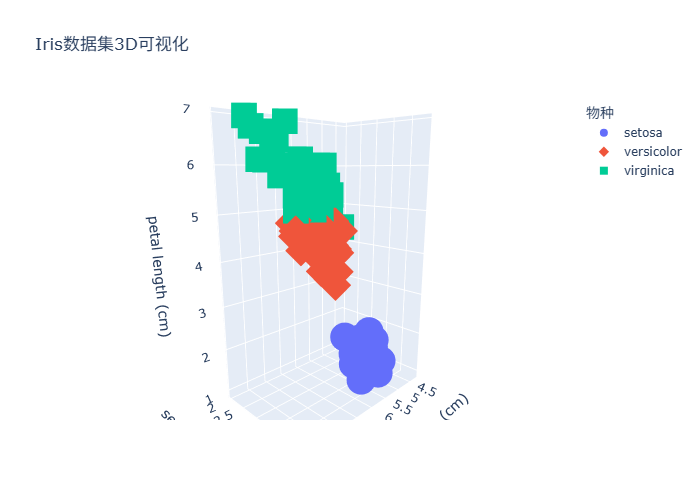
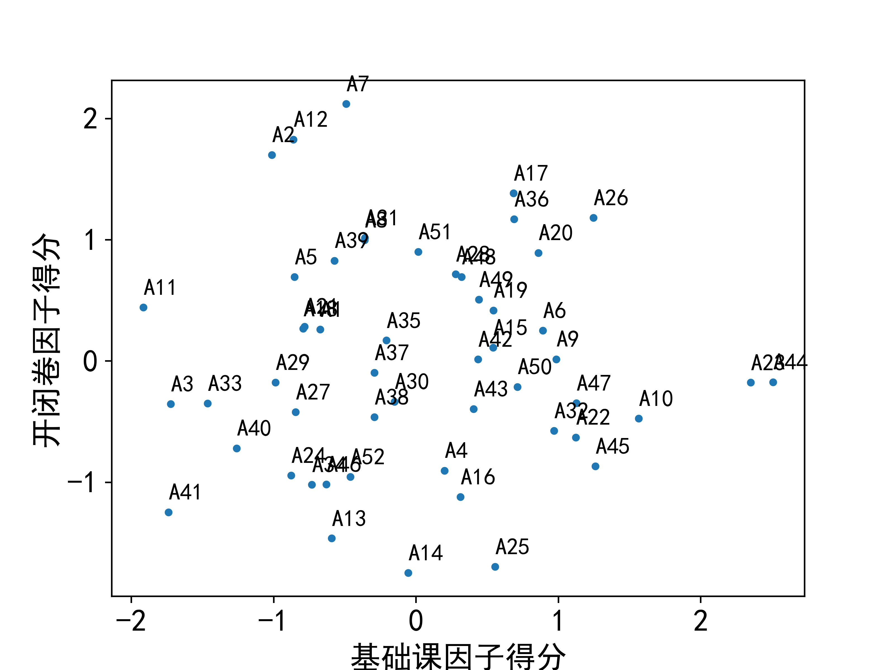

# Python 数学实验与建模

> 从公式到代码，从理论到实验——一个关于数学建模与科学计算的学习记录。

为了备战数学建模国赛且基于`Python`强大的可视化能力和生态，我选取教材《Python数学实验与建模》(2021版)。

在2025年暑假期间，**中间穿插着我们专业三个实习，最长一天学习时间长达14小时，学习时长一个半月**，我终于几乎学完了整本书(第20章时间不足且要留下几天进行模拟和团队熟悉)，**学习时全程对照电子书自学(没有视频教程，可能比较小众)，不懂就问大模型**，当时还没有学数据结构，有的算法真的把我折磨的痛不欲生(尤其是Dijkstra和遗传算法、模拟退火次之)，当时**用`conda`配置环境就花了我两天时间，因为书中的python版本太老了😅**。

这个仓库就是在这个过程中一点点积累起来的。19个章节，86个notebook，从最基础的Python语法到智能算法，从数值积分到Lorenz混沌系统。每个notebook都是一次"把数学问题变成可运行代码"的尝试(**注意：凸优化部分的代码或者是太老了，或者是python版本不一致，跑不通**)。

## 技术栈

| 类别 | 工具 | 用途 |
|------|------|------|
| 科学计算 | NumPy, SciPy | 矩阵运算、数值积分、优化求解、统计分布 |
| 符号计算 | SymPy | 微分方程符号解、代数运算 |
| 数据处理 | Pandas | 数据读取、清洗、分析 |
| 可视化 | Matplotlib | 数据绘图、结果展示、动画 |
| 机器学习 | scikit-learn | 分类、回归、降维、聚类 |
| 图论建模 | NetworkX | 最短路、生成树、网络流、PageRank |
| 凸优化 | CVXPY, CVXOPT | 线性规划、整数规划、二次规划 |
| 统计建模 | statsmodels | 时间序列、回归诊断 |

## 项目结构

```
├── 第1章     语法基础/              # Python基础
├── 第2章     数据处理与可视化/       # Pandas, Matplotlib, scipy.stats
├── 第3章     高等数学和线性代数/     # 数值积分、非线性方程、矩阵运算
├── 第4章     概率论与数理统计/       # 分布、假设检验、方差分析
├── 第5章     线性规划/              # linprog, cvxopt, cvxpy
├── 第6章     整数规划和非线性规划/    # 分支定界、梯度下降
├── 第7章     插值和拟合/            # Lagrange、样条、最小二乘
├── 第8章     微分方程模型/           # Euler法、Runge-Kutta、Lorenz混沌
├── 第9章     综合评价方法/           # AHP、TOPSIS、模糊评价
├── 第10章    图论模型/              # Dijkstra、Floyd、MST、最大流、PageRank
├── 第11章    多元分析/              # PCA、因子分析、聚类、判别
├── 第12章    回归分析/              # 多元回归、Ridge/Lasso、Logistic
├── 第13章    差分方程模型/           # Leslie模型、阻滞增长
├── 第14章    模糊数学/              # 模糊聚类、模糊综合评价
├── 第15章    灰色系统预测/           # GM(1,1)、GM(1,N)、GM(2,1)
├── 第16章    Monte Carlo 模拟/      # 随机变量模拟、MC方法
├── 第17章    智能算法/              # 模拟退火、遗传算法、BP神经网络
├── 第18章    时间序列分析/           # 移动平均、指数平滑、ARIMA
├── 第19章    支持向量机/             # SVM分类、SVR回归
├── Pandas/                         # Pandas专题练习
├── docs/                           # 学习笔记与建模方法总结
├── images/                         # 实验结果图
│
├── requirements.txt
├── LICENSE
└── .gitignore
```

---

## 几个印象深刻的实验

### 1. Lorenz 混沌系统——确定性系统中的"蝴蝶效应"

[8.1 微分方程模型的求解方法.ipynb](第8章%20%20%20%20微分方程模型/8.1%20%20%20%20微分方程模型的求解方法.ipynb)

用 odeint 求解 Lorenz 方程组：

$$\dot{x} = \sigma(y-x), \quad \dot{y} = \rho x - y - xz, \quad \dot{z} = xy - \beta z$$

两个初值只差 0.0001，但轨迹随时间急剧分离。这个实验让我第一次直观感受到：确定性系统也可以产生看似随机的行为。数值方法不只是"算出答案"，它能揭示方程本身的动力学性质。

<p align="center">
  
</p>

### 2. 设备更新问题——把现实问题"翻译"成图论

[10.2 最短路算法及其 Python 实现.ipynb](第10章%20%20%20%20图论模型/10.2%20%20%20%20最短路算法及其%20Python%20实现.ipynb)

一个设备用了几年，什么时候该换新的？看起来是个经济学问题，但建模成图论问题后，节点是"年份"，边是"继续用旧设备的成本"或"买新设备的成本"，直接用 Dijkstra 求最短路就能得到最优更新策略。

这种"问题抽象"的过程比算法本身更有意思——同一个 Dijkstra 算法，可以解决设备更新、路径规划、网络路由等完全不同的问题。

<p align="center">
  
</p>

### 3. 手写 Dijkstra vs 调用 NetworkX

[10.2 最短路算法及其 Python 实现.ipynb](第10章%20%20%20%20图论模型/10.2%20%20%20%20最短路算法及其%20Python%20实现.ipynb)

学习经典算法时，我坚持先手写一遍再用库。Dijkstra 的手写实现大概30行代码，核心是一个贪心策略：每次选离起点最近的未访问节点，逐步扩展。写完之后再看 NetworkX 的 `dijkstra_path`，就知道它内部在做什么了。

Floyd-Warshall 也是。三重循环初看很暴力，但"经过 k 个中间节点"的递推思想其实很优雅。

```python
def Dijkstra_all_minpath(matr, start):
    n = len(matr)
    dis = [0] * n
    vis = [0] * n
    path = [[] for _ in range(n)]
    # ... 贪心扩展
```

### 4. GM(1,1) 灰色预测——小样本建模

[15.2 灰色 GM(1, 1) 预测模型.ipynb](第15章%20%20%20%20灰色系统预测/15.2%20%20%20%20灰色%20GM(1,%201)%20预测模型.ipynb)

灰色系统预测的思路很特别：数据量很少（比如只有5-6个年份的数据），传统统计方法用不了，但通过累加生成序列，可以把看似杂乱的数据变成近似指数增长的序列，再用微分方程拟合。

$$\frac{dx^{(1)}}{dt} + ax^{(1)} = b$$

这种方法在实际建模竞赛中很实用——很多题目给出的数据量就是不够用传统方法的。

### 5. 模拟退火解 TSP——启发式算法的魅力

[17.1 模拟退火算法.ipynb](第17章%20%20%20%20智能算法/17.1%20%20%20%20模拟退火算法.ipynb)

TSP 问题是 NP-hard 的，精确求解对大规模实例不现实。模拟退火的思路是：先随机生成一个解，然后不断尝试"微调"（交换两个城市），如果新解更好就接受，更差就以一定概率接受（避免陷入局部最优）。

用100个随机目标做实验，最终得到了一条相当合理的路径。这个实验让我理解了"启发式"的含义：不保证最优，但在合理时间内给出足够好的解。

---

## 从这些实验中学到的

**数学建模的核心是"翻译"。** 把一个实际问题变成数学语言——定义变量、构造目标函数、列出约束条件——这个过程比调用求解器难得多。线性规划、整数规划、图论建模，本质上都是在练习这种"翻译"能力。

**数值方法是"用有限逼近无限"。** 数值积分（矩形、梯形、Simpson）、微分方程数值解（Euler、Runge-Kutta）、迭代法求方程根——这些方法的共同思想是把连续问题离散化，用有限步计算逼近理论解。理解了这个本质，学新方法就快了。

**先手写再调库。** Dijkstra、Floyd、AHP、PCA 这些算法，先从零实现一遍，再用库函数，理解深度完全不一样。手写的过程会暴露很多细节——边界条件、数值稳定性、初始化——这些在直接调库时很容易忽略。

**可视化是最好的 debug。** 画个图比 print 一堆数字直观得多。Lorenz 吸引子的3D轨迹图、设备更新问题的最短路标注、PCA 的方差贡献率曲线——很多结论看图就能明白，光看数字很难建立直觉。

**对比实验比只看理论更有收获。** 比如比较 Euler 法和 odeint 的精度差异、比较手写算法和库函数的性能、比较不同插值方法的拟合效果——这种对比能加深对方法适用条件的理解。

---

## 与 AI/机器学习的联系

学完这些方法后回头看，发现很多 AI/ML 的底层其实就是这些数学工具：

- **优化是核心。** 线性规划、非线性规划、梯度下降——机器学习的训练过程本质上就是在解一个优化问题。理解了 scipy.optimize 的用法，再看 PyTorch 的 optimizer 就不陌生了。
- **概率统计是基础。** 假设检验、参数估计、贝叶斯推断——这些是理解机器学习模型评估、特征选择、模型选择的前提。
- **数值方法支撑计算。** 矩阵分解（SVD、特征值分解）是 PCA 的基础，也是深度学习中很多操作的基础。数值积分在概率模型中随处可见。
- **图论与网络。** 图神经网络（GNN）就是把深度学习和图论结合。PageRank 的思想在推荐系统中也有应用。
- **降维与数据理解。** PCA、因子分析、聚类——这些多元分析方法是数据预处理和特征工程的常用工具。

这些联系不是硬凑的——它们是数学本身的内在关联。打好这些基础，转向 AI/ML 方向会更顺畅。

---

## 核心内容

### 数值分析与科学计算

| 主题 | 内容 |
|------|------|
| 数值积分 | 矩形公式、梯形公式、Simpson公式 |
| 非线性方程 | 二分法、Newton迭代法 |
| 线性代数 | 矩阵运算、特征值分解、最小二乘解 |

### 运筹优化

| 主题 | 内容 |
|------|------|
| 线性规划 | 单纯形法、内点法 |
| 整数规划 | 分支定界法 |
| 非线性规划 | scipy.optimize.minimize |
| 投资组合 | 风险与收益的权衡建模 |

### 概率统计

| 主题 | 内容 |
|------|------|
| 随机变量 | 常见分布、数字特征 |
| 参数估计 | 点估计、区间估计 |
| 假设检验 | t检验、卡方检验 |
| 方差分析 | 单因素、多因素方差分析 |

### 微分方程与动力系统

| 主题 | 内容 |
|------|------|
| 符号解法 | SymPy dsolve |
| 数值解法 | Euler法、梯形法、odeint |
| 混沌系统 | Lorenz吸引子、初值敏感性 |
| 建模实例 | 传染病模型(SIR)、捕食-被捕食模型 |

### 图论与网络优化

| 主题 | 内容 |
|------|------|
| 最短路径 | Dijkstra（手写实现 + NetworkX） |
| 全源最短路 | Floyd-Warshall |
| 最小生成树 | Kruskal、Prim |
| 网络流 | 最大流、最小费用流 |
| PageRank | 网页排序算法 |

### 多元分析与机器学习

| 主题 | 内容 |
|------|------|
| 降维 | PCA、因子分析 |
| 聚类 | K-Means、层次聚类 |
| 回归 | 多元线性回归、Ridge/Lasso、Logistic |
| 分类 | SVM、判别分析 |

### 建模方法

| 主题 | 内容 |
|------|------|
| 综合评价 | AHP、TOPSIS、模糊综合评价 |
| 预测方法 | 灰色系统 GM(1,1)、ARIMA |
| 差分方程 | Leslie人口模型、阻滞增长 |
| 随机模拟 | Monte Carlo方法 |
| 智能算法 | 模拟退火、遗传算法、BP神经网络 |

---

## 其他实验结果

<p align="center">
  
  
</p>

<p align="center">
  
  
</p>

---

## 学习路线回顾

整个学习过程大致分成了几个阶段：

**工具入门（第1-2章）**
Pandas 读数据、Matplotlib 画图。这是后面所有实验的基础。

**数值计算基础（第3-4章）**
数值积分、非线性方程求解、矩阵运算、假设检验——科学计算的基本功。这一阶段最大的体会是：数学分析里的"精确解"在实际问题中往往不存在，数值方法才是常态。

**优化建模（第5-6章）**
线性规划让我第一次感受到"建模"的魅力。一个复杂的实际问题，只要能"翻译"成目标函数+约束条件，就能用工具直接求解。难点不在调用 linprog，而在于如何定义变量、构造目标、写出约束。

**建模方法积累（第7-12章）**
插值拟合、微分方程、综合评价、图论、多元分析、回归分析——大量方法的集中学习。印象最深的是微分方程建模和图论，前者把物理过程变成方程再数值求解，后者把现实问题抽象成图再用算法解决。

**进阶方法（第13-19章）**
差分方程、模糊数学、灰色系统、Monte Carlo、智能算法、时间序列、SVM——各有各的应用场景。模拟退火解 TSP 和 Lorenz 混沌系统是这一阶段最有意思的两个实验。

回头看，最大的收获不是学会了某个具体算法，而是建立了"把实际问题抽象为数学模型，再用代码求解"的思维方式。

---

## Future Work

- [ ] 将部分 notebook 重构为可复用的 Python 模块
- [ ] 增加更多经典算法的从零实现
- [ ] 引入 PyTorch/JAX 做深度学习相关的数学实验
- [ ] 补充凸优化理论与实践
- [ ] 增加数学建模竞赛真题的完整求解
- [ ] 探索 Physics-Informed Neural Networks (PINN)

## License

MIT License
